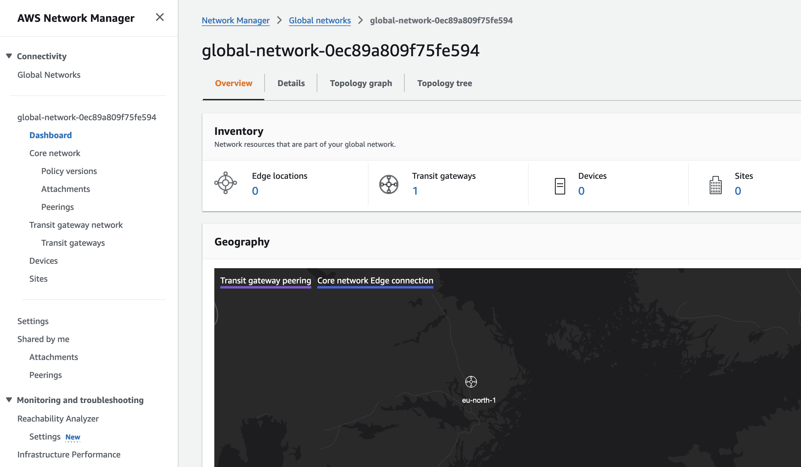
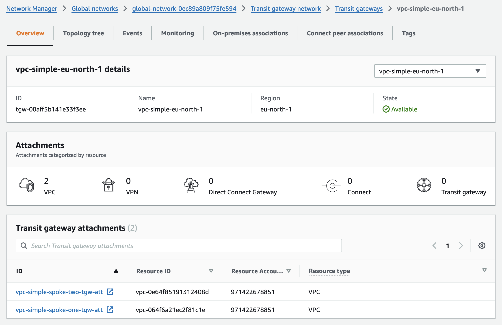
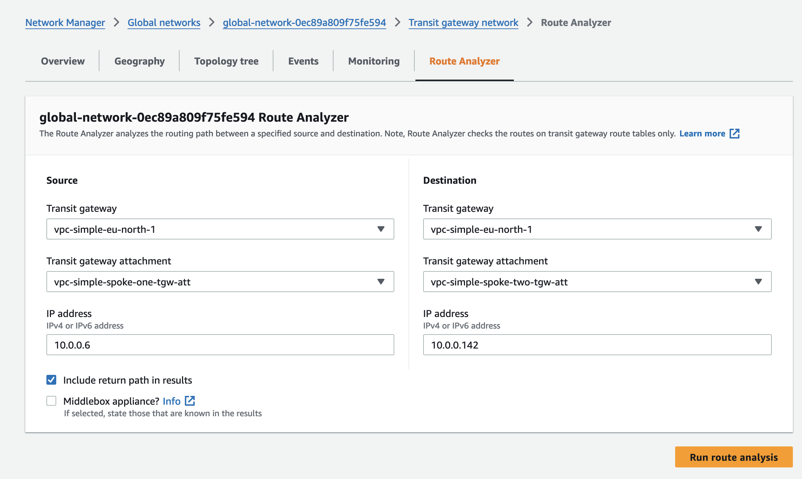
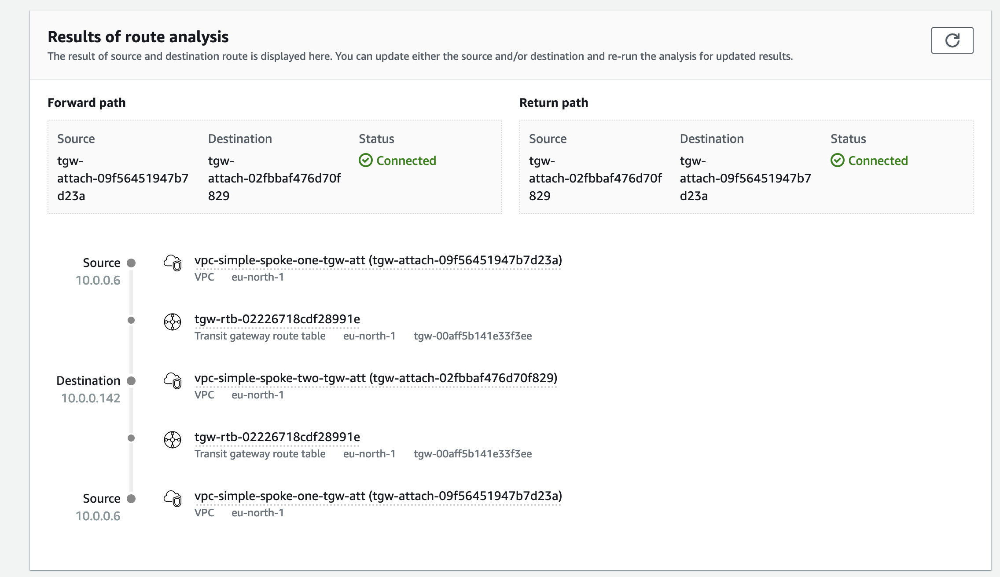
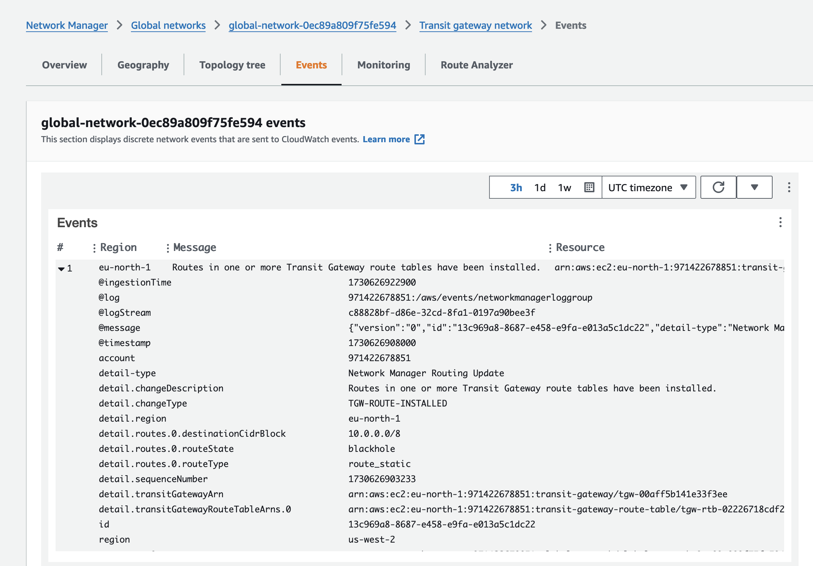

# Enhancing Network Observability, Detection, and Alerting for AWS Transit Gateway Networks

This document outlines the strategies and tools implemented to achieve comprehensive network observability, detection, and alerting for a Transit Gateway network with multiple spoke VPCs. By leveraging AWS Network Manager and Amazon CloudWatch, we register and monitor key network components, ensuring real-time visibility into network changes, streamlined detection of potential issues, and prompt alerting to maintain optimal network performance and reliability.

## Network Observability

### Centralized Network Management

AWS Network Manager acts as a central hub for managing global networks, allowing for a unified view of network resources across AWS accounts and Regions. Key resources observed include:

- **Transit Gateways**: Connect VPCs and on-premises networks.
- **VPC Attachments**: Connections between Transit Gateways and VPCs.
- **VPN Connections**: Secure connections between on-premises networks and AWS.
- **Direct Connect Gateways and Connections**: High-bandwidth, low-latency dedicated connections.
- **Network Manager Devices**: On-premises registered devices.
- **Links and Connections**: Connections linking sites and devices.
- **Sites**: Represent data centers or branch offices.
- **Core Network Policies**: Define network operation and traffic routing.

## Transit Gateway Network

A Transit Gateway network in AWS Network Manager is a centralized architecture that facilitates the management and operation of complex, multi-VPC and on-premises network infrastructures. It acts as a global hub, connecting and orchestrating various resources such as VPCs, VPN connections, and Direct Connect links. By using AWS Network Manager, organizations can register and observe Transit Gateways and their attachments, enabling a unified view of network topology, status monitoring, and streamlined configuration management across multiple AWS accounts and regions. This setup enhances visibility, simplifies management, and supports efficient traffic routing within a global network.

### Route Analysis

The Route Analyzer tool enhances network observability by allowing route analysis of Transit Gateway route tables. This feature helps:

- Verify configurations before traffic flow.
- Validate existing route configurations.
- Diagnose route-related connectivity issues.

The following rules apply when using the Route Analyzer:

- The Route Analyzer analyzes routes in transit gateway route tables only. It does not analyze routes in VPC route tables or in your customer gateway devices.
- The transit gateways must be registered in your global network.
- The Route Analyzer does not analyze security group rules or network ACL rules. To capture information about accepted and rejected IP traffic in your VPC, you can use VPC flow logs.
- The Route Analyzer only returns information for the return path if it can successfully return information for the forward path.

By using the Route Analyzer tool, AWS Network Manager simulates the traffic path, providing detailed insights into the routes taken, potential routing issues, and any connectivity problems that might impact network performance

## Detection and Alerting

### CloudWatch Integration

Amazon CloudWatch Events, integrated with AWS Network Manager, provides near-real-time streams of system events for monitoring changes in AWS resources. This setup includes:

- **Event Types**:
  - **Topology Change Events**: Reflect resource changes like VPN creation or deletion.
  - **Routing Update Events**: Indicate updates or withdrawals of routes.
  - **Status Update Events**: Track changes in resource status (e.g., VPNs going up or down).

### Automated Response and Alerting

Configuring CloudWatch event rules and log groups allows for automated, event-driven responses to network changes, ensuring timely detection and alerting for potential network issues.

---

## Flow Logs

VPC Flow Logs and Transit Gateway Flow Logs both capture network traffic data, but they serve different parts of your AWS network infrastructure and have unique characteristics.

### Key Differences

**VPC Flow Logs:** Capture traffic at the network interface level within a specific VPC, providing detailed insights into traffic flows related to individual instances and subnets.

**Transit Gateway Flow Logs:** Capture traffic as it passes through an AWS Transit Gateway, offering visibility into traffic between VPCs, on-premises networks, and other connected resources.

#### Use Case Focus

- **VPC Flow Logs:** Needed for monitoring traffic within a single VPC, troubleshooting issues, and analyzing traffic blocked or allowed by security groups and network ACLs. By centralizing Flow Logs from multiple VPCs into central storage system you will be able to run analysis and inspect traffic behavior across your entire network.

- **Transit Gateway Flow Logs:** Useful for monitoring and understanding traffic routing and connectivity at a higher level across multiple VPCs and hybrid networks.

- **AWS Customer Support:** When contacting AWS Support about network issues it is imperative that you can provide flow logs and metrics to support in troubleshooting or any claims. What - When - Why!

#### Traffic Details

- **VPC Flow Logs:** Provide details such as source and destination IP, protocol, and port for individual network interfaces.

- **Transit Gateway Flow Logs**: Provide broader traffic data across connected resources, with insights into how traffic traverses through the Transit Gateway, helping to validate routing configurations.

### Log Destinations

Both types of flow logs can be sent to various destinations for analysis and long-term storage:

- Amazon CloudWatch Logs: For real-time monitoring and alerting.
- Amazon S3: For archival and large-scale data analysis.
- Amazon Kinesis Data Firehose: For real-time data processing and loading into data lakes or analytics services.

Integrating both VPC and Transit Gateway Flow Logs enhances the observability posture by providing a detailed, multi-layered view of network activity. VPC Flow Logs offer granular traffic details within specific VPCs, while Transit Gateway Flow Logs provide a macro-level perspective across VPCs and connected networks. This dual approach ensures comprehensive monitoring, aids in quick diagnosis of issues, supports security and compliance efforts, and optimizes network performance. It is also considered an AWS best-practice to enable VPC Flow Logs for all VPCs.

---

### References

- <https://docs.aws.amazon.com/network-manager/latest/tgwnm/monitoring-events.html>
- <https://docs.aws.amazon.com/network-manager/latest/tgwnm/route-analyzer.html#example-route-analyzer-middlebox>
- <https://docs.aws.amazon.com/network-manager/latest/tgwnm/monitoring-cloudwatch-metrics.html>
- <https://docs.aws.amazon.com/vpc/latest/userguide/flow-logs.html>
- <https://docs.aws.amazon.com/vpc/latest/tgw/tgw-flow-logs.html>
