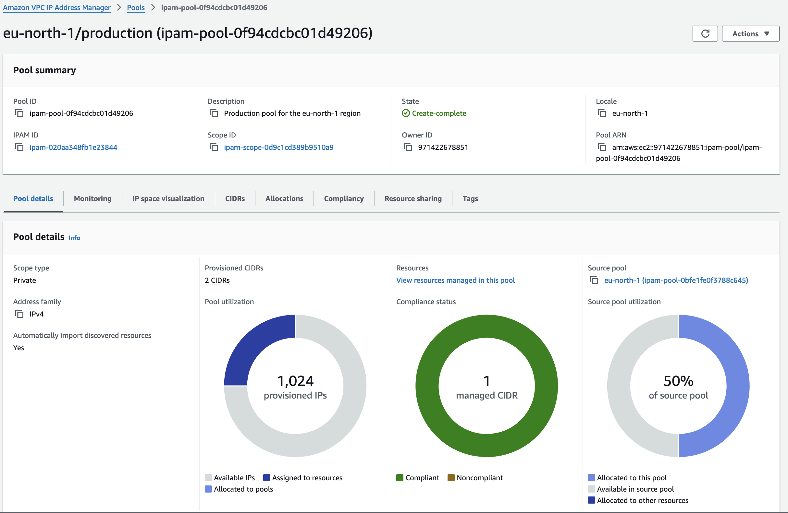
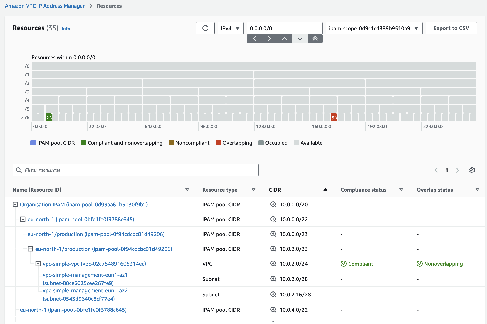
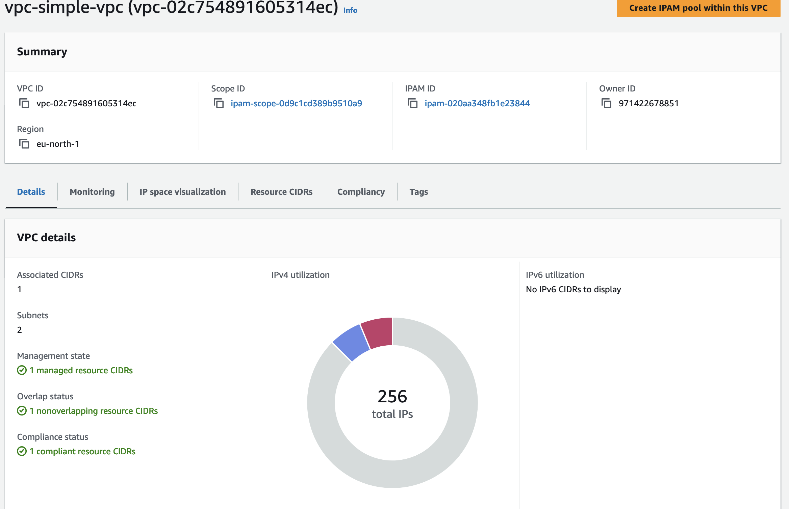
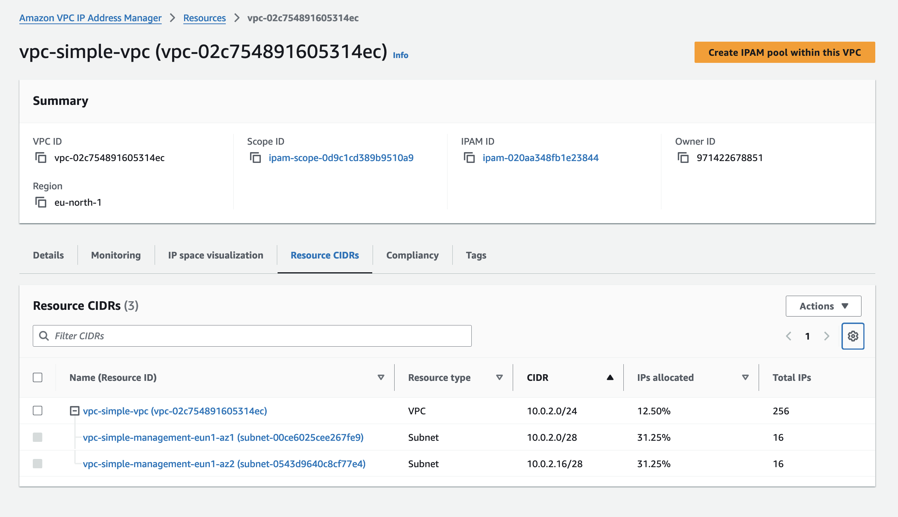
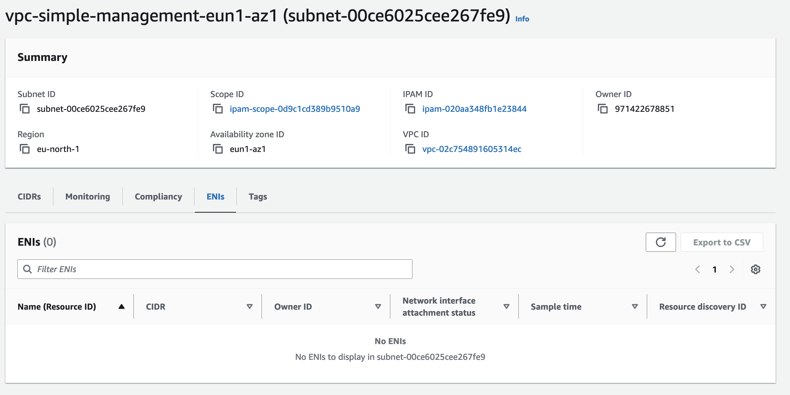

# AWS IP Address Manager (IPAM)

This example demonstrates how to use AWS IP Address Manager (IPAM) to manage IP addresses across multiple VPCs in different regions with advanced configurations.

## AWS IP Address Manager (IPAM)

AWS IP Address Manager (IPAM) is a service that helps you plan, track, and manage IP addresses for your AWS workloads. IPAM provides a central place to manage IP addresses, enabling you to automate IP address assignment and track IP address usage across your AWS environment.

### Features

- **Centralized IP Address Management**: IPAM provides a single interface to manage IP addresses across multiple AWS accounts and regions.
- **Automated IP Address Assignment**: IPAM can automatically assign IP addresses to your resources, reducing the risk of IP address conflicts.
- **IP Address Monitoring**: IPAM continuously monitors IP address usage and provides insights into IP address utilization.
- **Compliance and Auditing**: IPAM helps you ensure compliance with your organization's IP address management policies and provides auditing capabilities.

### Public vs Private Scope

IPAM supports two types of scopes:

#### Private Scope

Used for managing private IP addresses. Private IP addresses are used within your AWS environment and are not accessible from the internet.

#### Public Scope

Used for managing public IP addresses. Public IP addresses are globally unique and can be accessed from the internet. This is part of IPAM Free Tier.

You can use Public IP insights to see the following:

- If your IPAM is integrated with accounts in an AWS Organization or in a single account, you can view all public IPv4 addresses used by services across all AWS Regions for your entire AWS Organization or a single account.

You can view insights into the following public IPv4 address types:

- Elastic IP addresses (EIPs): Static, public IPv4 addresses provided by Amazon that you can associate with an EC2 instance, elastic network interface, or AWS resource.

- EC2 public IPv4 addresses: Public IPv4 addresses assigned to an EC2 instance by Amazon (if the EC2 instance is launched into a default subnet or if the instance is launched into a subnet that’s been configured to automatically assign a public IPv4 address).

- BYOIPv4 addresses: Public IPv4 addresses in the IPv4 address range that you’ve brought to AWS using Bring your own IP addresses (BYOIP).

- Service-managed IPv4 addresses: Public IPv4 addresses automatically provisioned on AWS resources and managed by an AWS service. For example, public IPv4 addresses on Amazon ECS, Amazon RDS, or Amazon WorkSpaces.

### Resource Discovery

IPAM can automatically discover and track IP address usage across your AWS environment. This includes:

- **VPCs**: IPAM can track IP address usage within your VPCs.
- **Subnets**: IPAM can track IP address usage within your subnets.
- **Elastic IPs**: IPAM can track the allocation and usage of Elastic IP addresses.

VPC discovered allocation

VPC discovered resources

Subnet discovered allocated enis

